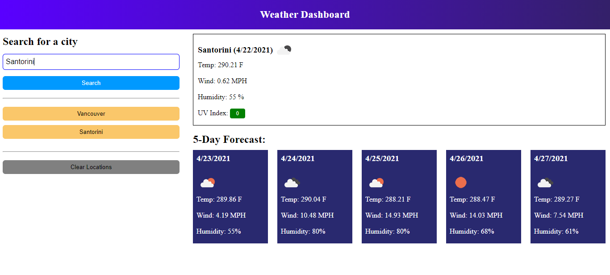

# P6-Weather-Dashboard

## App Description
In this app you will be able to enter a city from where you want to know today's and the next 5 days weather and it will bring to you that information.

## Screenshot

## Using the Weather App
### Entering the name of the place
You will see an input where you can put the name of the city or place from where you want to get the weather information.

### Stored places
Below the input, there is a section where you can see all the previous places from where you wanted to see the weather information.

### Clear locations
In case you wish to erase all the saved places you looked for, you can do it by pressing the clear locations button.

## Link to the app
